# 💡 Life Switch

Control physical switch in the real world, remotely.

<br>

## 🎥 Demo

[](https://www.youtube.com/watch?v=VIDEO_ID)

<br>

## Why Life Switch?

Lying in my bed, I didn't want to get up just to turn off the lamp. I also wanted to be able to turn it off from outside my home, in case I forgot to switch it off before leaving.

There are still many devices that require physical interaction.<br>
Building this project as a starting point for remotely controlling the analog switches and buttons in our homes.

<br>

## Approach

Most existing ways to control lighting remotely fall into three categories:

- Cutting wires and rewiring the switch into a smart switch
- Cutting external power with a smart plug
- Replacing the bulb with a smart bulb

All three share the same limitation — they can't use the lamp's original physical switch, and they carry wiring risk or require modifying/replacing the product.

Life Switch takes a different approach: a motor-based module attached to the outside of the switch, operating the existing physical switch directly — no rewiring, no bulb replacement.

<br>

## Tech Stack

| Layer | Tech |
|---|---|
| Motor | DYNAMIXEL XC330-M288-T |
| Motor controller | OpenRB-150 |
| Microcontroller | ESP32 (Wi-Fi) |
| Backend | FastAPI + WebSocket |
| Frontend | GitHub Pages (static) |
| Relay server | VPS + custom domain (`switch.jaewon-orbit.com`) |
| 3D design | Autodesk Fusion |
| Dev/testing tunnel | Cloudflare Tunnel |

<br>

## Architecture

```text
📱 Phone
   ↓ HTTPS
GitHub Pages
   ↓ WSS
☁️ VPS (FastAPI relay)
   ↑ WSS
ESP32
   ↓ UART
OpenRB-150
   ↓
XC330
```

**Why a VPS?**
ESP32 sits behind a home router and can't accept inbound connections. Instead, it connects *outbound* to the VPS, which relays messages between the browser and ESP32 — no port forwarding needed.

**Status sync**
Status isn't polled continuously — it's only requested when needed: on page refresh (via the WebSocket `open` event) or after a toggle command. The server reads the motor's Present Position and compares it against the two known endpoints (`1350` ≈ ON, `1900` ≈ OFF) to decide which state to show.

<br>

## Hardware Assembly

1. Right now, Life Switch remotely controls the physical switch of my IKEA TÅGARP floor lamp.

<div align="center">
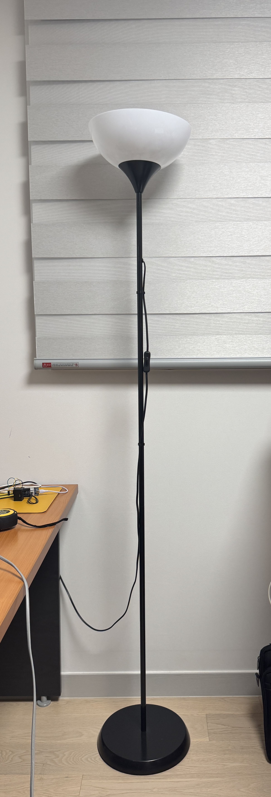
</div>
<br>
2. And this is the lamp's inline rocker switch.

<div align="center">
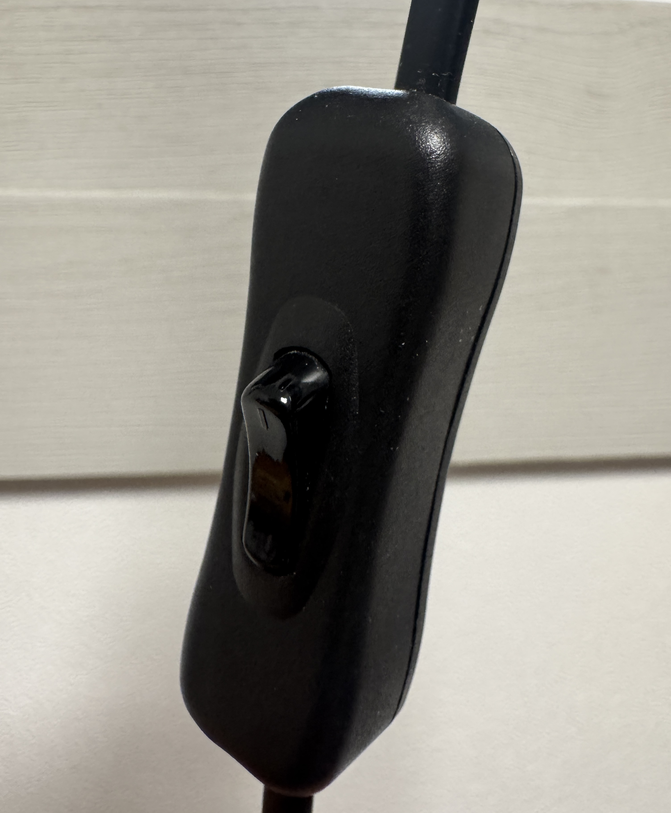
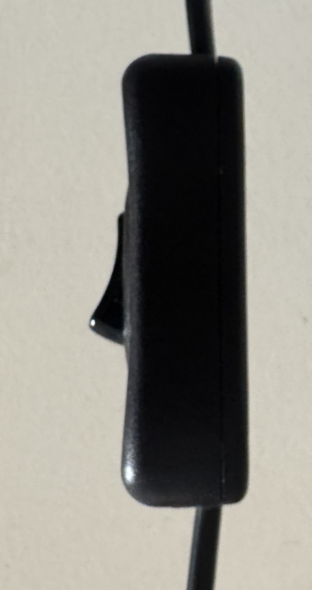
</div>
<br>
3. Removed the stock plain horn from the XC330's output disc, and mounted ROBOTIS official XC330 horn (HNX330-N102), onto the output shaft with its center screw.<br>
[📦 Download XC330 Horn (HNX330-N102) STP file](./docs/models/XL_XC_330_HORN.stp)
<div align="center">
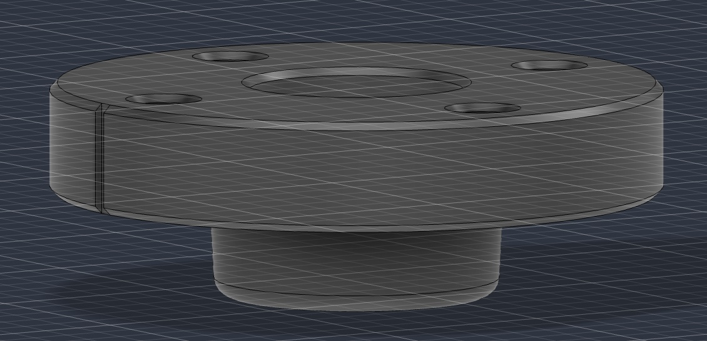
</div>
<br> 
4. Designed a teardrop-shaped horn in Autodesk Fusion, and mounted it onto the HNX330-N102 with M2×6mm screws.<br>
[📦 Download Teardrop-Shaped Horn STP file](./docs/models/teardrop_horn.stp)
<div align="center">
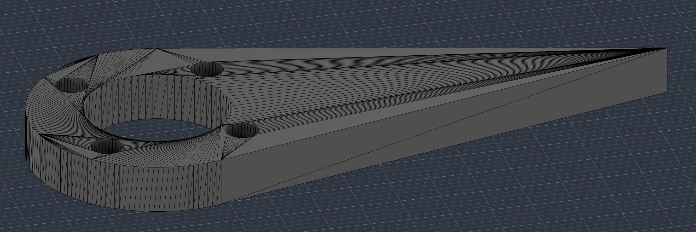
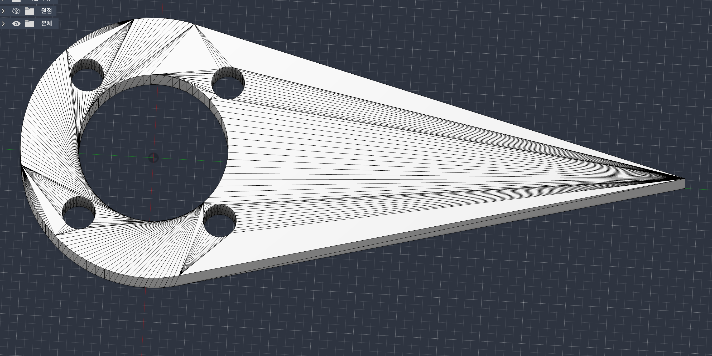
<a href="https://www.youtube.com/watch?v=VIDEO_ID"></a>
</div>
<br> 
5. Attached the motor + horn next to the lamp's inline rocker switch with cable ties, using the horn to physically toggle it.
<div align="center">
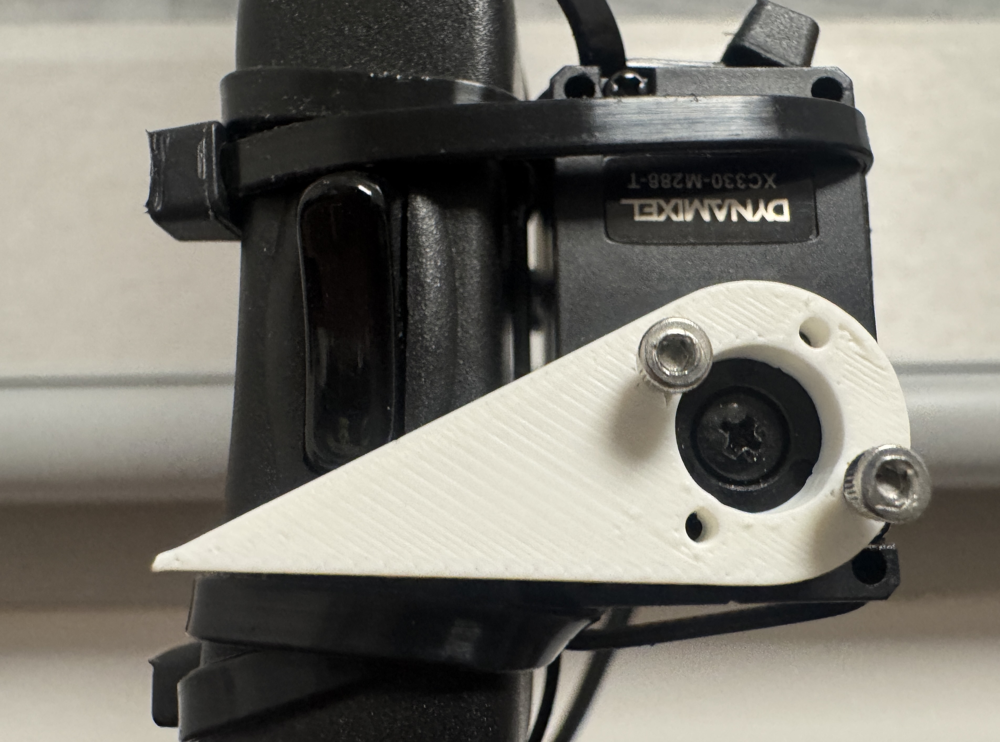
</div>
<br> 
6. Put the ESP32 and OpenRB-150 in a small basket, and cable-tied the basket to the lamp's pole.
<div align="center">
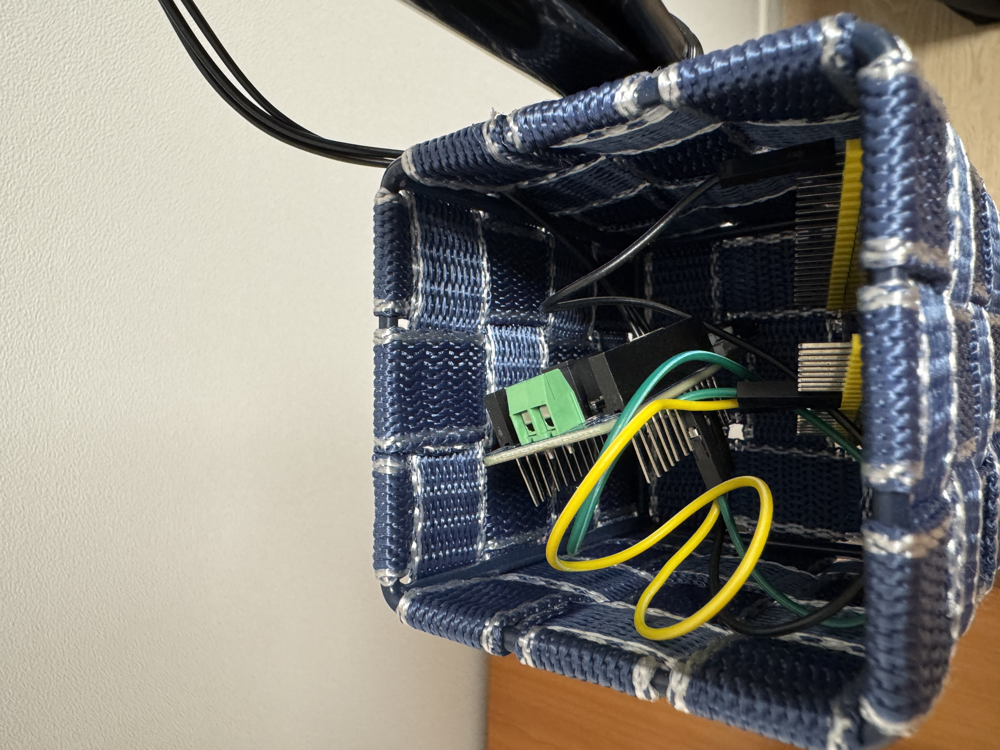
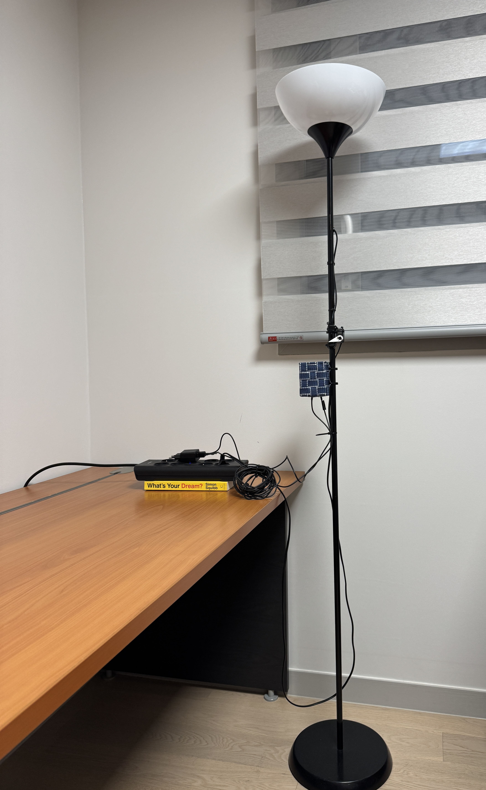
</div>

<br>

## Progress

- **Remote control over LTE** — controlled the motor from a mobile browser over LTE via Cloudflare Tunnel.

  

- **Motor: XM430 → XC330** — switched to a smaller motor; refactored control code to use motor profiles instead of hardcoded values.
- **UI revamp** — simplified the browser UI for clearer switch control.

  | Before | After |
  |:---:|:---:|
  |  |  |

- **Standalone control** — connected ESP32 + OpenRB-150 to control the motor without a PC.

  

- **VPS WebSocket relay** — deployed a VPS to relay WebSocket traffic between GitHub Pages and ESP32, avoiding port forwarding.
- **Current-based position control** — switched from position control to current-based position control to protect the motor and the 3D-printed horn.
- **Status sync on refresh** — the browser now requests the real motor position (`STATUS`) whenever the WebSocket connects or a toggle is pressed, instead of relying on a stored default.
- **UI, round 2** — after adding current-based position control and status sync, simplified the UI further to show only what the user actually needs.

  | Before | After |
  |:---:|:---:|
  | 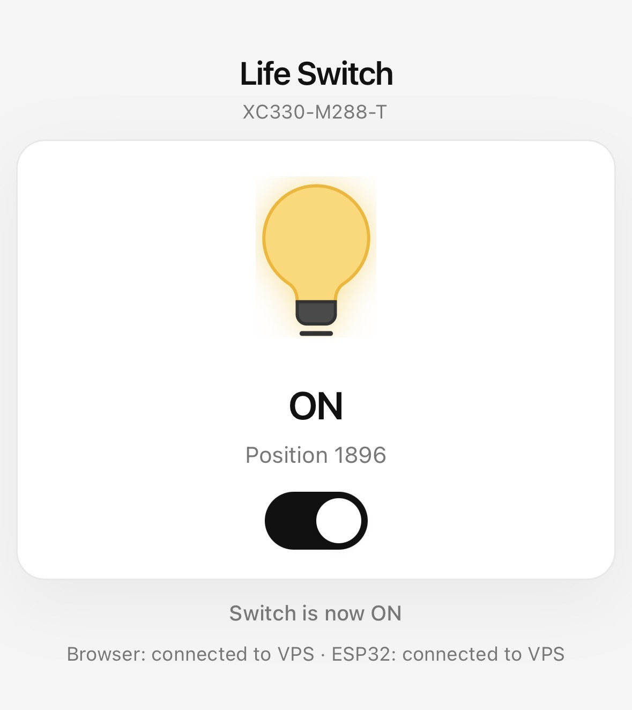 | 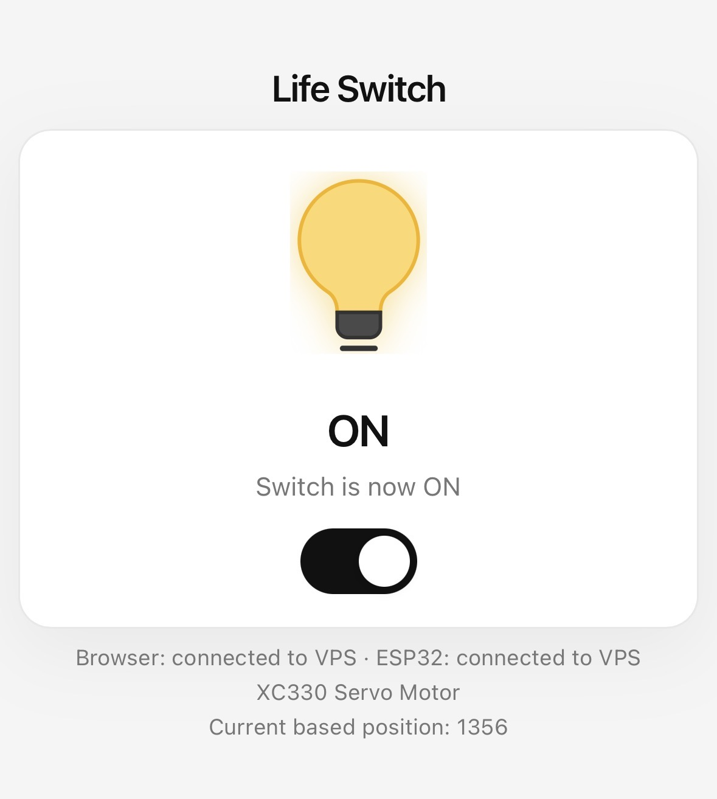 |

<br>

## Usage

Open the GitHub Pages site and tap the toggle. That's it — it works the same over LTE or outside the house, thanks to the VPS relay.

<details>
<summary>Legacy: local dev testing via Cloudflare Quick Tunnel</summary>

Used early on to test the browser UI from a phone before the VPS relay existed. Not needed for normal use anymore.

```bash
python -m uvicorn src.server:app --host 127.0.0.1 --port 8000
bash scripts/start_quick_tunnel.sh
```

`cloudflared` prints a random `https://…trycloudflare.com` URL, valid only while the tunnel is running.

</details>

<br>

## Roadmap

### Phase 1 — Motor Control
- [x] Set up Python environment, DYNAMIXEL Wizard 2.0 / SDK, U2D2
- [x] Control the motor with Python scripts, using motor profiles
- [x] Switch from XM430 to XC330-M288T
- [x] Apply current-based position control to protect the motor and horn

### Phase 2 — Remote Control
- [x] Web interface for PC / mobile via FastAPI
- [x] Remote control over LTE via Cloudflare Tunnel
- [x] Revamp the UI for simpler switch control

### Phase 3 — Standalone Control
- [x] ESP32 + OpenRB-150 controlling the XC330
- [x] ESP32 connected to the internet, no port forwarding
- [x] VPS WebSocket relay with a custom domain
- [x] Sync switch status with the real motor position on refresh

### Phase 4 — Physical Integration
- [x] Design a 3D-printed horn for the XC330 (Autodesk Fusion)
- [x] Mount motor + horn on the lamp's inline rocker switch
- [x] Build an ESP32 + OpenRB housing, attach to the lamp pole
- [x] Simplify the UI around current-based position + status sync

<br>

## User Requirements

Enter your Wi-Fi SSID and password in `secret.h` so the ESP32 can connect to Wi-Fi.
