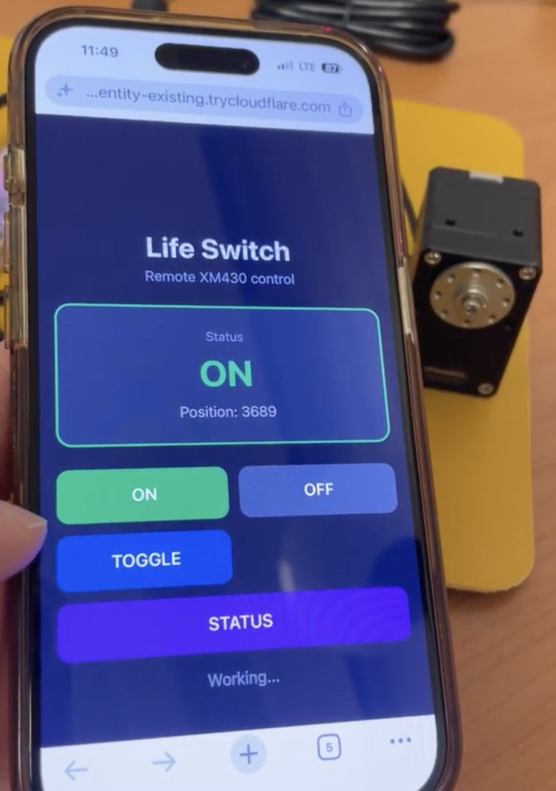
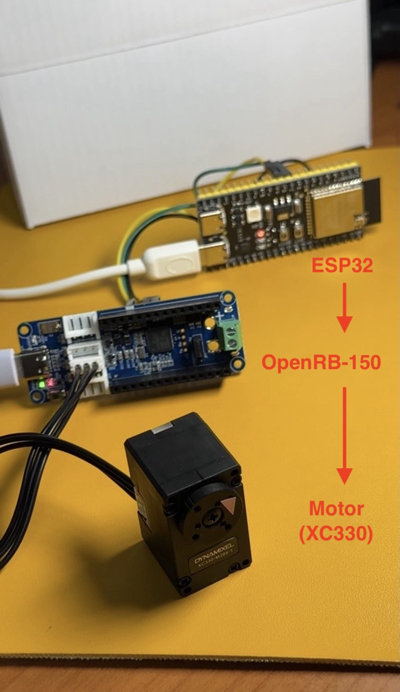

# 💡 Life Switch

Control physical switch in the real world, remotely.
<br>
<br>
# Why Life Switch?
During a summer heat wave, I wanted to turn on the air conditioner before getting home. <br>
Another time, I left home and suddenly wondered, "Did I turn off the air conditioner?"
<br><br>
There's many devices still require physical interaction.
<br>
Long story short, I need it.
Hope it’s easy to make.
<br>
<br>
# now now now Latest Updates

### 1. Remote Control over LTE

Successfully controlled the motor remotely from a mobile browser over LTE using Cloudflare Tunnel.



### 2. Motor Change: XM430 → XC330

Changed the motor from XM430 to XC330-M288T-T, which is smaller and more suitable for the physical switch prototype.

The motor control code was also refactored to use motor profiles instead of motor-specific rotation values. This allows different motors to be tested without changing the core control logic.

### 3. UI Revamp

Redesigned the browser UI to make the remote switch control simpler and more intuitive.

| Before | After |
|:---:|:---:|
|  |  |

### 4. Next? Standalone Control

The next goal is to control the switch independently from a PC.

ESP32 + OpenRB-150 will be used to connect the motor to the internet and enable remote control from a mobile device.

Planned architecture:

Mobile Browser
→ Internet / LTE
→ ESP32
→ OpenRB-150
→ XC330
→ Physical Switch

WebSocket is being considered for bidirectional communication, with a custom domain potentially used for the remote connection.

Also, I will gonna use current-based control instead of position control to improve safety.

### 5. OpenRB-150 XC330 control (current test setup)

OpenRB-150 now controls the XC330-M288-T directly. The firmware in
[`firmware/openrb_xc330/`](./firmware/openrb_xc330/) receives commands over its
USB connection and runs a 180° return trip at the configured speed; it turns
torque and DYNAMIXEL power off when finished.


run this scripts to move the motor with OpenRB
(my port is (/dev/ttyACM0))

```bash
python scripts/move_openrb_xc330.py --port /dev/ttyACM0
```

this sends `MOVE` to the OpenRB. Existing
[`scripts/move_motor.py`](./scripts/move_motor.py) remains the separate U2D2
motor-control script.

### 6. ESP32 Control

Successfully controlled the robot with ESP32, using OpenRB as the motor control interface.
Starting from the ground up is always the key to solving complex problems.



<br>
<br>

## Test 3-1 — FastAPI through a Cloudflare Quick Tunnel

Use this temporary setup to access the existing XC330 web UI from a phone on
LTE. It does not need a custom domain or a Cloudflare account.

In the first terminal, start the existing FastAPI server:

```bash
python -m uvicorn src.server:app --host 127.0.0.1 --port 8000
```

In a second terminal, create the Quick Tunnel:

```bash
bash scripts/start_quick_tunnel.sh
```

`cloudflared` prints an `https://…trycloudflare.com` URL. Open that exact URL
on the phone while Wi-Fi is turned off. The root URL redirects to `/xc330`
when the XC330 is connected; otherwise open `https://…trycloudflare.com/xc330`.

The Quick Tunnel URL is random and stops working as soon as `cloudflared` is
stopped. Treat it like a temporary public remote-control link: share it only
with people you trust. The FastAPI server stays bound to `127.0.0.1`, so only
the Cloudflare tunnel exposes it externally.

# Roadmap

### Phase 1 — Motor Control

* Developing in Linux
* Set up Python environment 
* Explore DYNAMIXEL Wizard 2.0 and DYNAMIXEL SDK 
* Explore U2D2 (USB to DYNAMIXEL, connecting a PC to a DYNAMIXEL motor) 
* Control the motor with Python scripts 
* Support different motors using motor profiles 
* Switch from XM430 to XC330-M288T-T 
* Use current-based control instead of position control for improved safety

### Phase 2 — Remote Control

* Create a web interface for PC and mobile 
* Control the motor from a browser using FastAPI 
* Access and control the motor remotely over LTE using Cloudflare Tunnel 
* Revamp the UI to make switch control simpler and more intuitive 

### Phase 3 — Standalone Control
Control the switch independently from a PC

* Use ESP32 + OpenRB-150 to control the XC330
* Connect the switch to the internet through ESP32
* Making VPS(Virtual Private Server) to use WebSocket
* Control the switch remotely from a mobile device
* Explore WebSocket for bidirectional communication
* Using a custom domain for the remote connection


### User Requirements
* You gotta enter your Wi-Fi SSID and password in secret.h file. This will make ESP32 connect to Wi-Fi.

### Current Architecture

```text
📱 Phone
   ↓ HTTPS
GitHub Pages
   ↓ JavaScript
   ↓ WSS
☁️ VPS / FastAPI
   ↑ WSS
ESP32
   ↓ UART
OpenRB-150
   ↓
XC330
